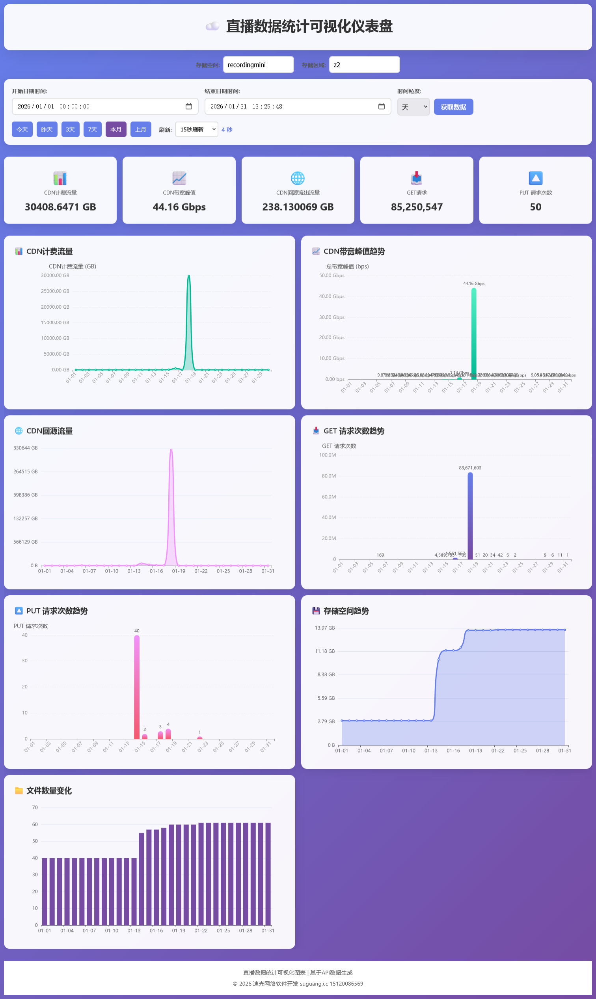

# 七牛云流量数据统计可视化仪表盘

基于七牛云官方API的实时数据监控和可视化仪表盘，用于展示CDN计费流量、CDN带宽峰值、CDN回源流出流量、GET请求次数、PUT请求次数、存储空间、文件数量等关键指标。

## 功能特点

### 📊 统计指标
- **CDN计费流量**: 统计两个域名的CDN计费流量数据
- **CDN带宽峰值**: 显示CDN带宽使用峰值
- **CDN回源流出流量**: 监控回源流量情况
- **GET请求次数**: 统计GET请求次数
- **PUT请求次数**: 统计PUT请求次数
- **存储空间**: 显示存储空间使用情况
- **文件数量**: 统计文件数量变化

### 📈 图表展示
- **CDN计费流量**: 展示流量随时间的变化趋势
- **CDN带宽峰值趋势**: 显示带宽使用趋势
- **CDN回源流量**: 监控回源流量趋势
- **GET请求次数趋势**: 展示GET请求变化趋势
- **PUT请求次数趋势**: 展示PUT请求变化趋势
- **存储空间趋势**: 显示存储空间使用趋势
- **文件数量变化**: 展示文件数量变化趋势

### 📱 响应式设计
- **桌面端**: 一行显示3个图表，7个统计卡片平铺显示
- **移动端**: 自适应屏幕宽度，单个图表全宽显示
- **多设备支持**: 兼容手机、平板、桌面端设备

## 技术架构

### 后端
- **框架**: Python Flask
- **核心依赖**: 七牛云Python SDK
- **API接口**: 
  - `/v6/space` - 存储量查询
  - `/v6/count` - 文件数量统计
  - `/v6/blob_io` - 流量与请求次数
  - `/v6/rs_put` - PUT请求次数
  - `/v2/tune/flux` - CDN流量统计
  - `/v2/tune/bandwidth` - CDN计费带宽

### 前端
- **技术栈**: HTML/CSS/JavaScript
- **图表库**: ECharts 5.4.3
- **图表类型**: 
  - 折线图（趋势分析）
  - 柱状图（数据对比）
  - 面积图（流量分布）
- **响应式**: CSS Grid + Media Queries
- **UI框架**: 原生CSS，无额外框架依赖
- **动画效果**: CSS过渡动画，平滑数据更新

## 配置说明

### config.py
```python
QINIU_CONFIG = {
    'access_key': 'YOUR_ACCESS_KEY',      # 七牛云Access Key
    'secret_key': 'YOUR_SECRET_KEY',      # 七牛云Secret Key
    'bucket_name': 'YOUR_BUCKET_NAME',    # 存储空间名称
    'region': 'z2',                       # 存储区域
    'base_url': 'https://api.qiniuapi.com',
    'cdn_domains': [                      # CDN域名列表
        'cdn.mshcodeadventure.top',
        'cdnv.mshcodeadventure.top'
    ]
}
```

## 使用方法

### 1. 环境准备
```bash
pip install qiniu requests flask
```

### 2. 配置API密钥
编辑 `config.py` 文件，填入您的七牛云Access Key和Secret Key

### 3. 启动服务
```bash
python qiniu_dashboard.py
```

### 4. 访问仪表盘
打开浏览器访问 `http://localhost:5000`

### 5. 数据查询
- 选择时间范围（支持3天、7天、本月、上月等预设）
- 选择时间粒度（天级别）
- 输入存储空间名称和区域（可选）
- 点击查询按钮获取实时数据

## API功能详解

### 存储用量查询
- **接口**: `/v6/space`
- **功能**: 查询指定时间范围内的存储空间使用情况
- **参数**: begin, end, g(粒度), $bucket, $region
- **返回**: 时间序列存储数据

### 文件数量统计
- **接口**: `/v6/count`
- **功能**: 统计指定时间范围内的文件数量变化
- **参数**: begin, end, g(粒度), $bucket, $region
- **返回**: 时间序列文件数量数据

### 流量与请求统计
- **接口**: `/v6/blob_io`
- **功能**: 获取流量和请求次数统计
- **参数**: begin, end, g(粒度), select, $metric, $bucket, $region
- **返回**: 流量和请求次数数据

### CDN流量统计
- **接口**: `/v2/tune/flux`
- **功能**: 获取CDN计费流量数据
- **参数**: startDate, endDate, granularity, domains
- **返回**: CDN流量时间序列数据

### CDN带宽统计
- **接口**: `/v2/tune/bandwidth`
- **功能**: 获取CDN计费带宽数据
- **参数**: startDate, endDate, granularity, domains
- **返回**: CDN带宽时间序列数据

## 图标说明

### 统计卡片图标
- 📊 - CDN计费流量
- 📈 - CDN带宽峰值
- 🌐 - CDN回源流出流量
- 📥 - GET请求次数
- 🔼 - PUT请求次数
- 💾 - 存储空间
- 📁 - 文件数量

## 响应式布局

### 桌面端 (≥1024px)
- 统计卡片: 一行显示7个
- 图表: 一行显示3个

### 平板端 (768px - 1023px)
- 统计卡片: 一行显示2个
- 图表: 一行显示1个

### 手机端 (<768px)
- 统计卡片: 一行显示1个
- 图表: 一行显示1个

## 软件界面


## 错误处理

### 常见错误
- **API连接失败**: 检查网络连接和代理设置
- **认证失败**: 确认Access Key和Secret Key正确
- **数据为空**: 检查时间范围和域名配置

### 错误提示
- 网络错误
- API认证失败
- 数据查询失败
- 服务器错误

## 安全说明

- 所有API请求均使用七牛云认证协议
- Access Key和Secret Key存储在配置文件中
- 不在客户端暴露敏感信息
- 支持HTTPS请求

## 维护与更新

### 数据刷新
- 支持手动刷新数据
- 支持定时自动刷新（可配置）
- 实时数据展示

### 性能优化
- 数据缓存机制
- 异步API请求
- 图表懒加载

## 开发说明

### 代码结构
```
qiniu_dashboard.py     # 主程序入口
api_manager.py         # API管理器
config.py              # 配置文件
```

### 依赖库
- qiniu: 七牛云官方SDK
- requests: HTTP请求库
- flask: Web框架
- echart: 图表库（前端）


## 技术支持

- **开发者：速光网络软件开发**
- 官网：suguang.cc
- 联系电话/微信：15120086569
- 抖音号：dubaishun12

## 版权信息

Copyright © 2026 速光网络软件开发. All rights reserved.

## 备注

本项目基于七牛云API开发，遵循相关服务条款。